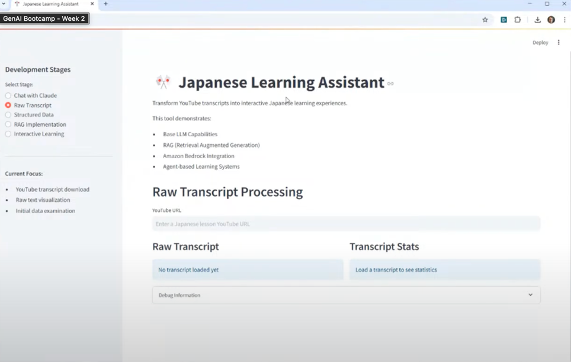
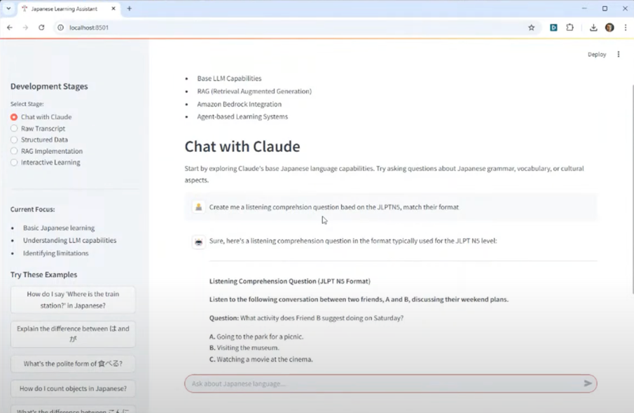

# Listening Learning App

### Business Goal: 
You are an Applied AI Engineer and you have been tasked to build a Language Listening Comprehension App. There are practice listening comprehension examples for language learning tests on youtube.

Pull the youtube content, and use that to generate out similar style listening comprehension.

## Technical Requirements:
- (Optional) Speech to Text, (ASR) Transcribe. eg Amazon Transcribe. OpenWhisper
- Youtube Transcript API (Download Transcript from Youtube)
- LLM + Tool Use “Agent”
- Sqlite3 - Knowledge Base 
- Text to Speech (TTS) eg. Amazon Polly
- AI Coding Assistant eg. Amazon Developer Q, Windsurf, Cursor, Github Copilot
- Frontend eg. Streamlit.
- Guardrails

------------------
## Technical Uncertainty:
- Don’t know Japanese!
- Accessing or storing documents as vector store with Sqlite3
- TSS might not exist for my target language OR might not be good enough.
- ASR might not exist for my target language OR might not be good enough.
- Can you pull transcripts for the target videos?

